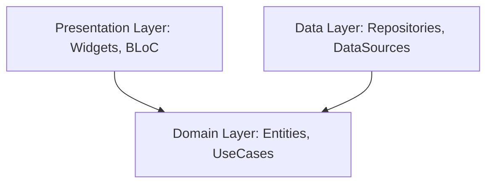

# 💎 Onyx - Premium Clean Architecture Personal Finance App

Onyx is a premium, state-of-the-art personal finance and expense tracker built with Flutter following strict **Clean Architecture** principles and powered by **Supabase**. It provides offline-first performance, local AI financial diagnostics, automatic transaction parsing, and custom visual themes.

---

## 🌟 Key Features & Advanced Polish

Onyx delivers a premium, fluid user experience matching modern mobile design standards:

### 🎨 Visual Identity & Custom Headers
- **Visual Theme Selection**: Select from 6 custom curated brand templates (Amethyst Purple, Emerald Green, Ocean Blue, Sunset Crimson, Obsidian Dark, Golden Amber). Themes cache locally across app restarts.
- **Glassmorphic Custom UI Sheets**: Glassmorphic theme selectors, currency selectors, and transaction sheet configurations.
- **Header Decoration Canvas**: Custom header canvas painters (`HeaderPainter`) rendering matching brand vectors dynamically across all pages.
- **Swipe-to-Reveal Balance Bar**: A secure, gamified sliding handle containing a cash-flow icon. Drag the handle to the right to reveal balance; snaps back to hidden state after 6 seconds to safeguard financial privacy.

### 🧠 Onyx AI Budget Diagnostics (Beta)
- **Local AI Analysis Engine**: Fully offline diagnostics processing transaction flows, savings ratios, category allocations, and wallet reserves.
- **Staggered Suggestions List**: Fluid fade-in and slide-up list transitions with calculated delays to provide a highly tactical feedback display.
- **Smart Warnings**: Automatically triggers in-app alerts when category budgets are breached or savings drop below threshold metrics.

### 📊 Offline-First Ledger & Statements
- **Dynamic Shimmer Loaders**: Premium skeletal shimmering loaders for Home and Wallet layouts, optimized via BLoC state to prevent flickering during silent background fetches.
- **SMS Auto-Detection**: Scans transaction alert notifications locally to auto-populate ledgers. Raw messages never leave the device.
- **PDF Report Generator**: Generates elegant, printable monthly transaction ledgers and financial statement spreadsheets.

---

## 🛠️ Technology Stack & Architecture

Onyx is built using a strict modular **Clean Architecture** to maintain clean boundaries between UI, domain rules, and data providers.

### Architecture Map

- **Presentation Layer**: Custom widgets, state management using Flutter BLoC, and page layouts.
- **Domain Layer**: Clean interfaces and core model definitions (`Expense`, `Wallet`), independent of external dependencies.
- **Data Layer**: Supabase DB synchronization, offline SQLite/Hive local storage cache repositories, and local system sensors (SMS parsing, PDF output).

---

## ⚠️ Limitations & Technical Constraints

- **SMS Auto-Parse Range**: The local parsing parser is calibrated for transactional formats and bank alerts. Standard personal texts are ignored. Requires explicit runtime permission.
- **Client-Side AI Model**: The Onyx AI Engine executes entirely offline on your phone's processor. It behaves as a diagnostic system rather than a cloud-hosted LLM to protect data privacy.
- **Background Synchronization**: Background syncing depends on Supabase database connectivity. If offline, the SQLite database queues operations and updates once connectivity is restored.

---

## 📄 Privacy & Compliance Policies

For compliance with Google Play Console and social authorization requirements:
- **Project Landing Page**: [Onyx Home](https://hamim5264.github.io/onyx-policy/index.html)
- **Privacy Policy**: [Onyx Privacy Policy](https://hamim5264.github.io/onyx-policy/privacy.html)
- **Data Deletion Instructions**: [Data Deletion Steps](https://hamim5264.github.io/onyx-policy/data-deletion.html)
- **Terms of Service**: [Onyx Terms](https://hamim5264.github.io/onyx-policy/terms.html)

---

## 👤 Developer Profile

**Abdul Hamim Leon**  
*Lead Software Developer*  

- **Portfolio**: [thedevhamim.vercel.app](https://thedevhamim.vercel.app/)
- **GitHub**: [github.com/hamim5264](https://github.com/hamim5264)
- **LinkedIn**: [linkedin.com/in/abdul-hamim-a35b02253](https://www.linkedin.com/in/abdul-hamim-a35b02253/)
- **Business site**: [devengine-three.vercel.app](https://devengine-three.vercel.app/)

---
&copy; 2026 Onyx App. All rights reserved. Built with pride by DevEngine.
